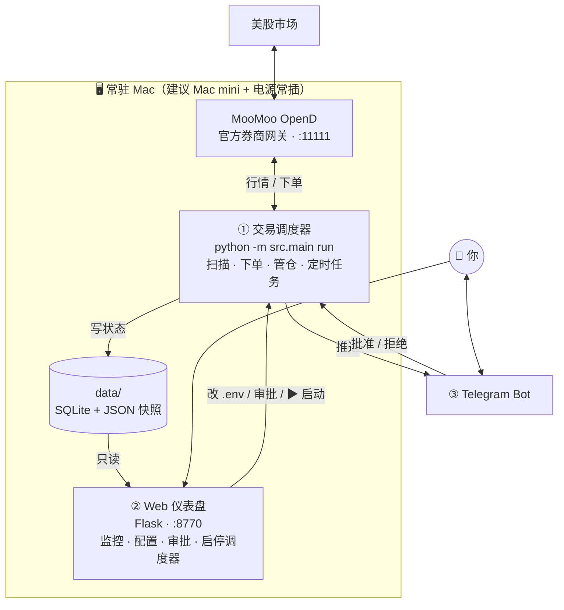
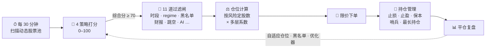

<div align="center">

# 📈 MooMoo Trader

**AI 驱动的美股全自动短线交易系统**

<em>An autonomous, risk-guarded US-stock swing-trading bot — multi-strategy scoring, AI context review, honest backtesting, web dashboard & Telegram approvals.</em>

<br/>


<br/>

[✨ 核心功能](#-核心功能) · [🚀 快速上手](#-快速上手) · [🔬 交易流水线](#-交易流水线) · [🤖 AI 自治](#-ai-自治系统) · [❓ FAQ](#-常见问题)

</div>

<!-- 📸 建议：把 Web 仪表盘截图放到 docs/screenshots/dashboard.png 后取消下面的注释
<p align="center">
  
</p>
-->

> [!WARNING]
> **交易有亏损本金的实质风险。** 本程序不保证盈利，必须先 paper trade（模拟盘）**至少 4 周**才可切真钱。作者不对任何亏损负责。详见[免责声明](#免责声明)。

---

## 这是什么

一个**自治的美股短线 swing 交易机器人**。它在美股交易时段每 30 分钟扫描一个每周自动重建的股票池，用 4 套技术策略打分，过 11 道风控/上下文过滤闸，自动下限价单并管理止损/止盈，全程通过 **Web 仪表盘 + Telegram** 监控和审批。

**设计目标：~95% 自动化。** 你平时只需要看 Telegram 推送，偶尔在 Web 面板批一下优化器提出的参数建议。

### 🧭 两条贯穿全系统的铁律

> **① Live ↔ 回测口径一致（parity）**
> 实盘成交的单子必须和「算出 $/day 的那套诚实回测」是同一批。任何会让实盘偏离回测的功能（如 AI 否决）默认设为「建议 / 不拦单」。
>
> **② 未验证不上线**
> 新策略 / 新退出逻辑只有在双窗口回测里**既提升收益又不恶化回撤**才允许开启。过不了这关就一直关着——代码留着，等数据。

理解这两条，就能理解为什么下文很多功能「默认关」。

---

## ✨ 核心功能

<table>
<tr>
<td width="50%" valign="top">

#### 🎯 多策略信号引擎
趋势、动量突破、均值回归、形态识别 4 套独立策略，统一 `Signal` 接口打分 0–100，综合分 ≥ 70 才进入候选。

</td>
<td width="50%" valign="top">

#### 🧱 11 道候选过滤闸
交易时段、市场 regime、黑名单、熔断、多周期确认、跳空、财报、买卖价差、AI 复核、硬风控、每轮限额——任何一道不过即放弃。

</td>
</tr>
<tr>
<td valign="top">

#### 🤖 AI 上下文复核
Gemini + Tavily 实时新闻，排查「技术指标看不到的雷」（诉讼、爆雷、监管……）。默认建议模式，只记录不拦单，保持回测口径一致。

</td>
<td valign="top">

#### 🛡️ 多层硬风控
单笔风险 5%、单股上限 40%、日内回撤熔断、账户回撤减仓/停盘、连亏冷却、VIX 缩仓。**AI 无权绕过任何一条。**

</td>
</tr>
<tr>
<td valign="top">

#### 📉 跳空哨兵
持仓股财报临近、或盘前 AI 判定有实锤利空 → 开盘自动清仓。止损单挡不住隔夜跳空，哨兵可以。

</td>
<td valign="top">

#### 🧠 自适应仓位与黑名单
按近 30 笔交易的 Sortino 动态调整风险倍数（0.5×–1.25×）；连亏股自动进观察期黑名单，恢复自动放出。

</td>
</tr>
<tr>
<td valign="top">

#### 🔄 每周动态选股
按 6-1 动量从流动性池自动重建 watchlist，走样本外回放避免幸存者偏差，每次变动 Telegram 通知——绝不静默漂移。

</td>
<td valign="top">

#### 🧪 诚实回测 + 双窗口闸门
账户级时间步进模拟（与实盘同一套行为）、Monte Carlo 1000 次、Sharpe/Sortino/Calmar 全套指标；另有独立 sandbox 引擎每周与回测做交易级对账。

</td>
</tr>
<tr>
<td valign="top">

#### ⚙️ 全自动参数优化
Optuna 贝叶斯调参 + AI 优化器 + 每日增量 sweep。护栏内的建议自动应用、退化自动回滚；越界的必须人工审批。

</td>
<td valign="top">

#### 📊 Web 仪表盘
持仓、净值曲线、美股板块热力图、审批队列、全部配置热更新（免重启），一键启停调度器；中英双语，手机可访问（需设密码）。

</td>
</tr>
<tr>
<td valign="top">

#### 📱 Telegram 通知与审批
下单 / 止损 / 状态实时推送，「批准 / 拒绝」按钮直接处理审批队列。重要变更没有你点头不会生效。

</td>
<td valign="top">

#### 💰 现金不闲置（可选）
熊市策略停开新仓时，自动把闲钱买入国债 ETF（SGOV）吃无风险收益；已实现盈利可自动复利滚入预算。均默认关。

</td>
</tr>
</table>

---

## 系统架构

三个**互相独立**的进程，通过共享的 `data/`（SQLite + JSON 快照）和 `.env` 解耦：



| 进程 | 职责 | 说明 |
|------|------|------|
| **MooMoo OpenD** | 行情 + 下单网关 | 富途/moomoo 官方本地网关，须全程运行；`start-web.command` 会自动拉起 |
| **① 调度器** | 真正的交易大脑 | APScheduler 驱动所有扫描、管仓、定时任务；从 Web 面板 ▶ Start 启动 |
| **② Web 仪表盘** | 监控 + 控制台 | **本身不交易**，只读快照、改配置、处理审批；停掉不影响交易 |
| **③ Telegram** | 通知 + 审批 | 推送下单/止损/状态，按钮处理审批队列 |

> 调度器与 Web 之间不直接通信。Web 上改模式/预算/审批，实际是写 db-state override 或 `.env`，调度器在下一轮扫描读到即生效（热参数**无需重启**）。

---

## 🚀 快速上手

### 环境要求

| 依赖 | 用途 | 获取 |
|------|------|------|
| macOS + Python 3.11+ | 运行环境 | 安装脚本会自动处理 Python |
| MooMoo OpenD | 行情 + 下单网关 | [openapi.moomoo.com](https://openapi.moomoo.com) 下载安装并登录 |
| moomoo App | 开户 + 设交易密码 | App Store 搜 "moomoo"（审核 1–3 工作日，开通 Paper Trading） |

**外部 API（都有免费层）：**

| 服务 | 用途 | 注册 | 免费额度 |
|------|------|------|---------|
| MooMoo OpenAPI | 行情 + 交易 | [openapi.moomoo.com](https://openapi.moomoo.com) | 免费 |
| Google Gemini | AI 复核 / 优化器 | [aistudio.google.com](https://aistudio.google.com) | 1500 req/天 |
| Tavily | 新闻搜索（喂给 AI） | [app.tavily.com](https://app.tavily.com) | 1000 req/月 |
| Telegram Bot | 通知 + 审批 | [@BotFather](https://t.me/BotFather) | 免费 |

### 1️⃣ 克隆 + 一键安装

```bash
git clone <your-repo-url> moomoo-trader
cd moomoo-trader
./setup-macmini.command
```

脚本自动完成：安装 [uv](https://astral.sh/uv) → 用 Python 3.11 重建 `.venv` 并装依赖 → 按当前路径安装 crontab 优化任务 → 自检 OpenD 与 `.env`。重复运行安全（幂等）。

<details>
<summary>不用脚本，手动安装</summary>

```bash
python3 -m venv .venv
source .venv/bin/activate
pip install -r requirements.txt
```

</details>

### 2️⃣ 配置 `.env`

```bash
cp .env.example .env
```

至少填这几项（模板里每项都有详细注释）：

| 键 | 说明 |
|----|------|
| `MOOMOO_TRADE_PWD` | 6 位**交易密码**（和登录密码分开，App → 设置 → 交易密码） |
| `GEMINI_API_KEYS` | 逗号分隔，可多 key 轮换 |
| `TAVILY_API_KEY` | 新闻搜索 |
| `TELEGRAM_TOKEN` / `TELEGRAM_CHAT_ID` | @BotFather 创建 |
| `ACCOUNT_USD` | 你分配的预算上限——程序**绝不**投入超过这个数 |

### 3️⃣ 启动

```bash
./start-web.command
```

它会自动：拉起 OpenD（若未运行）→ 启动 Web 仪表盘 → 打开浏览器 `http://127.0.0.1:8770`。

然后在面板上点 **▶ Start** 启动交易调度器（独立进程，关掉浏览器照样交易）。

```bash
# 等价 CLI 方式
python -m src.main run    # 直接跑调度器
python -m src.main scan   # 单次扫描调试（不进循环）
```

启动后调度器会：补跑关机期间错过的定时任务 → 美股开盘后每 30 分钟扫一次 → Telegram 推送下单/止损/状态。

---

## 🔬 交易流水线



### 第 1 步：策略打分

对 watchlist 每只股票，4 套独立策略各打 0–100 分，取最高分代表该股票。4 套共用同一个 `Signal` 接口，下游漏斗不关心信号来自哪套（只记 `strategy` 标签）。

> **当前实盘只跑前两套（趋势 + 动量突破）；均值回归、形态识别默认关**——原因见[配置速览](#-配置速览)。入场门槛：综合分 ≥ `ENTRY_SCORE_THRESHOLD`（**70**，Optuna 调出，硬门槛无边缘带）。

| 策略 | 模块 | 风格 | 状态 |
|------|------|------|:----:|
| ① 趋势 | `indicators.py` | EMA/MACD/量能/ADX/VWAP 六因子共振 | ✅ |
| ② 动量突破 | `strategy_momentum.py` | 专抓放量突破 20 根新高（出手少、单笔大） | ✅ |
| ③ 均值回归 | `strategy_mr.py` | 震荡市超卖反弹 | ❌ 默认关 |
| ④ 形态识别 | `strategy_pattern.py` | 双底/三角/头肩底/牛旗等几何形态 | ❌ 默认关 |

<details>
<summary><b>📐 展开：各策略因子与权重明细</b></summary>

> 每套策略权重总和 = 90（历史上 AI 复核占最后 10 分，现已改为独立的建议层，不并入分数）。
>
> **名词速记**：**EMA** 指数移动均线（近期价权重更高）｜**MACD** 快慢均线差，判动量转向｜**RSI** 相对强弱 0–100，>70 超买 <30 超卖｜**Stochastic** 收盘价在近期高低区间的位置｜**ADX** 趋势强度（非方向）｜**VWAP** 成交量加权均价（机构成本线）｜**BB** 布林带，均线 ±2σ 通道｜**ATR** 真实波幅均值，用来定止损/止盈距离。

**策略 ① 趋势**（实盘 HOUR_1 权重）：

| 因子 | 含义 | 满分条件 | 权重 |
|------|------|---------|:--:|
| trend 趋势 | EMA9 > EMA21 且斜率向上 | 金叉+向上 100 / 走平 60 / 死叉 0 | **18** |
| momentum 动量 | MACD 金叉 + RSI 40–70 + Stochastic 20–80 | 三者齐全 100 / 部分 70/40 | **18** |
| volume 量能 | 当根量 ÷ 20 根均量 | ≥1.5× → 100 / ≥1.0× → 50 | **14** |
| pattern 形态 | 突破 20 根新高 / 布林下轨反弹 | 突破 100 / 下轨反弹 90 / 收红 40 | **14** |
| adx 趋势强度 | ADX 值 | ≥25 → 100 / ≥20 → 70 / ≥15 → 30 | **13** |
| vwap | 收盘价 vs 20 周期滚动 VWAP | 高于 +0.5% → 100 / 持平 60 | **13** |

**策略 ② 动量突破**（更挑，专抓爆发性突破）：

| 因子 | 满分条件 | 权重 |
|------|---------|:--:|
| breakout 突破 | 收盘超 20 根高点 ≥ 0.3×ATR | **30** |
| volume 量能 | ≥ 2× 均量 | **25** |
| adx_trend | ADX ≥ 30（真趋势非震荡） | **20** |
| structure 结构 | EMA9 > EMA21 > EMA50 完全多头排列 | **15** |

**策略 ③ 均值回归**（默认关）：oversold 超卖（RSI<25 + 跌破布林下轨）25 / reversal 反转（锤子线、收复下轨）25 / volume 20 / non_trend（ADX<25 才有效）20。

**策略 ④ 形态识别**（默认关）：pattern_quality 形态质量 30 / trigger 是否突破关键位 25 / volume 20 / trend_alignment 15。可选 `pattern_vision`（Gemini 渲染 K 线图后看图确认），也默认关。

</details>

### 第 2 步：候选漏斗

打分 ≥ 70 的信号按分数从高到低，逐一过闸——**任何一道不过就跳过该股票**：

| # | 闸 | 规则 | 模块 |
|---|----|------|------|
| 1 | 交易时段 | 09:45–15:30 ET；周五 14:00 后不开新仓（防周末跳空） | `kill_switch` |
| 2 | 市场环境 | SPY 同时跌破 50 & 200 日均线 = BEAR → 禁开新仓 | `regime` |
| 3 | 自适应黑名单 | 近期连亏股在观察期内 → 跳过 | `blacklist` |
| 4 | 熔断 | 日内回撤 / 账户回撤停盘 / 3 连亏 → 禁开 | `kill_switch` |
| 5 | 多周期确认 | 日线 EMA20 > EMA50（HOUR_1 模式必查） | `indicators` |
| 6 | 隔夜跳空 | \|跳空\| > 4% → 拒（不追高、不接刀） | `indicators` |
| 7 | 财报屏蔽 | 距下次财报 ≤ 2 天 → 拒 | `earnings` |
| 8 | 买卖价差 | bid-ask spread > 0.5% → 拒（流动性差） | `moomoo_client` |
| 9 | AI 复核 | Gemini + Tavily 查「指标看不到的雷」；**建议模式不拦单**，下单后才问以省延迟 | `ai_validator` |
| 10 | 风控闸 | 24h 止损冷却 / 持仓数上限 / 现金 / 预算上限 | `risk_manager` |
| 11 | 每轮新股上限 | 每轮最多 2 只新股，加仓老仓不占额度 | `main` |

### 第 3 步：仓位计算

`risk_manager.calc_position_size` — 多层独立相乘的「按风险定股数」：

```text
基础风险金额 = 可用资金 × RISK_PER_TRADE(5%)
   × 连亏降温     （2 连亏 0.75× / 3 连亏 0.5×）
   × 账户DD减仓   （账户回撤 ≥ 10% → 0.5×）
   × 自适应仓位   （近 30 笔 Sortino → 0.5× ~ 1.25×）
   × conviction   （满分信号 1.0）
   × 顺势加压     （仅「强牛 + 低 VIX」→ 1.4×）

按风险股数 = 风险金额 ÷ (入场价 − 止损价)
按上限股数 = 资金 × MAX_POSITION_PCT(40%) ÷ 入场价      ← 单股集中度上限
最终股数   = min(两者)，再按 VIX 调（>25 减半，>35 砍到 1/4）
```

- **资金口径**：用你分配的预算 `ACCOUNT_USD`，但绝不超过实时账户净值。预算可在 Web 面板改，下一轮扫描生效。
- **单股上限 40% 才是防跳空的真护栏**——止损挡不住跳空（价格直接跳过止损位），所以靠「不押太大」而非「盯得更勤」。

### 第 4 步：退出管理

止损/止盈全部按 ATR 缩放（`executor.py` 管理）：

| 退出方式 | 触发 | 状态 |
|---------|------|:--:|
| 软止损 SL | 价 ≤ 入场 − 3.5×ATR | ✅ 常开 |
| 止盈 TP | 价 ≥ 入场 + 10×ATR | ✅ 常开 |
| 保本移动止损 | 浮盈 +1R → 止损上移到入场价（赢单不再变亏单） | ✅ |
| 快速止损环 | 每 60 秒单查软止损 + 保本（补模拟盘无原生 STOP 单的延迟） | ✅ |
| 最长持仓 | 满 7 个交易日强平 | ✅ 常开 |
| 跳空哨兵 | 持仓股财报 ≤1 天 / 盘前 AI 实锤利空 → 开盘清仓 | ✅ |
| 黑名单 / 超额平仓 | 持仓股进黑名单强平；持仓数超限平掉最差的 | ✅ 常开 |
| 分批止盈 scale-out | +3R / +6R 各卖 1/3 | ⚠️ 故意空转（回测证明会杀掉肥尾利润） |
| 智能退出 / 停滞退出 | 盘中 AI 利空锁盈 / 几天不动腾资金 | ❌ 默认关（未过验证闸门） |

> **手动仓位接管**：你自己在 moomoo App 买的票，对账时会被「收养」并标记 `user_managed`（对所有自动退出免疫）。系统评估后：正常则交给 bot 管止损；高风险则发 Telegram 审批让你决定。

---

## 🛡️ 风控硬约束

AI 和优化器**都不能**绕过这些：

| 规则 | 阈值 | 动作 |
|------|------|------|
| 单笔风险 | 5% | 按风险定股数 |
| 单股仓位 | 40% | 股数上限 |
| 同时持仓数 | 5（随预算缩放） | 拒开新仓 |
| 日内回撤 | −6% | 当日停盘 |
| 账户回撤 ≥ 10% | 半仓 | 所有新仓 0.5× |
| 账户回撤 ≥ 18% | 停盘 | 7 天后自动解除 |
| 3 连亏 | 连续 3 天净亏 | 暂停开仓 |
| 止损冷却 | 同一股 24h | 不再买入 |
| 财报屏蔽 | ≤ 2 天 | 拒开新仓 |
| Regime BEAR | SPY 破位 | 禁开新仓 |
| VIX 调仓 | >25 / >35 | 减半 / 砍 1/4 |

---

## 🤖 AI 自治系统

> 目标：95% 自动化，你只看 Telegram。

1. **自适应仓位**（`adaptive_sizing.py`）— 读近 30 笔已平仓交易，按交易日级 Sortino 调风险倍数：热手 1.25×、常态 1.0×、冷手 0.75×、连败 0.5×。
2. **自适应黑名单**（`blacklist.py`）— 连亏股进观察期（门槛随整体 Sortino 浮动）；恢复立即移除，持续差则延长复评（最长 90 天）。
3. **每周动态选股**（`universe.py`）— 从流动性池按 6-1 动量选 top-15 重建 watchlist，走样本外回放避免幸存者偏差，每次变动 Telegram 通知。
4. **AI 优化器 + Autopilot**（`optimizer_ai.py` / `autopilot.py`）— 每周复盘真实成交 → AI 提小幅参数建议 → 每条都在诚实引擎上双窗口回测（180d + 360d）→ 只有**击败基线且不恶化回撤**才进队列。护栏内自动应用 + 退化自动回滚；越界必须人工批。
5. **每日增量 sweep + 每周全网格**（`cron/optimize_and_apply.sh`，crontab 驱动）— 每天补昨日数据做邻域校验，每周休市日跑全网格 sweep。
6. **每月 Optuna 调参**（`optimizer.py`）— TPE 贝叶斯 + 样本外 K 折，只发 Telegram 建议，**从不自动改 `.env`**。
7. **Sandbox 差分对账**（`sandbox.py` + `scripts/sandbox_vs_backtest.py`）— 独立模拟引擎每周与回测引擎做**交易级**对账，分歧超容差才报警——防止两套引擎悄悄漂移。
8. **健康哨兵**（`health_check.py` / `autopilot.health_check`）— API 额度、订阅、扫描停摆、对账漂移……只在出问题时通知（边沿触发，不刷屏）。
9. **错过任务自动补**（`cron_state.py`）— 关机期间错过的定时任务，开机自动补跑，多次错过只补一次。

### 审批闸（变更的唯一入口）

任何**非静默的改动**（参数变更、手动仓位接管、越界的优化器建议）都必须经过审批队列（`approvals.py`）才会执行。审批可在 Web 面板或 Telegram 按钮处理，批准后下一轮扫描生效。

> 边界清晰：**bot 自己的单子 bot 自己决定**（从不问你）；只有你手动下的单、或越界的参数变更才会触发审批。

---

## 🧪 回测与调参

```bash
# 诚实账户级回测（时间步进 portfolio simulation，与实盘同一套行为）
python -m src.backtest --days 180
python -m src.backtest_v3          # v3 引擎（含 scale-out / breakeven / 动态池样本外）

# Optuna 调参（样本外 K 折）
python -m src.optimizer --days 180 --trials 20 --folds 3 --min-trades 60
```

输出包含：Win rate / Profit factor / Expectancy、Sharpe / Sortino / Calmar / MAR / Ulcer、Max DD / 水下天数、**Monte Carlo 1000 次 P(profitable)**、月度 PnL。

> [!NOTE]
> **诚实预期**：不会月月赚。年化 ~15–25% + 最大回撤 ~10% 是真实区间。回测里的各项 $/day 数字是特定窗口的相对结论，不是承诺；市场结构变化（regime change）会让任何策略亏钱。

---

## ⏰ 自动定时任务

<details>
<summary><b>展开完整任务表</b></summary>

**调度器内置任务**（APScheduler，关机错过自动补跑）：

| 时间 | 任务 | 模块 |
|------|------|------|
| 每 30 分钟（交易时段） | 扫描信号 + 管仓 + 下单 | `run_loop` |
| 每 5 分钟（盘中持仓时） | 管仓 tick（止损/止盈/最长持仓） | `_manage_tick` |
| 每 60 秒（盘中持仓时） | 快速止损环（仅软止损 + 保本） | `_fast_stop_tick` |
| 工作日 08:30 ET | 盘前 NTP 校时 + 假日检查 | `_preopen_clock_check_job` |
| 工作日 09:00 ET | 盘前跳空哨兵分析 | `_premarket_gap_sentinel_job` |
| 工作日 09:31 ET | 开盘清仓被标记的跳空风险股 | `_open_gap_exit_job` |
| 工作日 16:45 ET | 复利预算结算（启用时） | `_daily_auto_budget_job` |
| 工作日 17:30 ET | Autopilot 健康守护 | `_watchdog_job` |
| 工作日 23:00 ET | 黑名单复评 | `_daily_blacklist_review_job` |
| 周一 20:00 KL | Autopilot 周复盘（建议→回测→护栏内自动应用） | `_weekly_autopilot_job` |
| 周一 20:05 KL | 动态选股刷新 | `_universe_refresh_job` |
| 周一 20:10 KL | 90 天回测健康检查 | `_weekly_backtest_validation_job` |
| 周一 20:15 KL | 真实成交自我复盘 | `_weekly_self_review_job` |
| 周一 20:25 KL | sandbox ↔ 回测交易级差分 | `_weekly_sandbox_diff_job` |
| 每月 1 号 03:00 ET | Optuna 调参（仅建议） | `_monthly_optuna_job` |
| 每月 1 号 03:30 ET | TP/SL 杠杆漂移复查（仅建议） | `_monthly_lever_recheck_job` |
| 每 5 分钟 | Telegram 审批同步 | `_tg_sync` |
| 每 30 分钟 + 启动时 | API / 订阅健康检查 | `_api_health_job` |
| 启动时 | 错过任务自动补跑 | `cron_state` |

**系统 crontab**（由 `setup-macmini.command` 安装，独立于调度器）：

| 时间（MYT） | 任务 |
|------------|------|
| 周一 07:00（美股休市时段） | 每周全网格 quick sweep 优化 |
| 周二至周六 09:00 | 每日增量优化（补昨日数据 + 邻域校验） |

> 周一批任务固定 Asia/Kuala_Lumpur 时区（无夏令时），美国 DST 切换不会挪动墙钟时间。

</details>

---

## 🔧 配置速览

全部配置在 `.env`（模板 [`.env.example`](.env.example) 每项含注释），常用项可在 Web 面板热更新。

<details>
<summary><b>默认开启的关键功能</b></summary>

| 配置 | 值 | 说明 |
|------|----|------|
| `MOOMOO_TRADE_ENV` | `SIMULATE` | 模拟盘。切 REAL 须在 Web 设置里做（2 次确认 + 交易密码 + 空仓才允许） |
| `GAP_SENTINEL_ENABLED` | `true` | 跳空哨兵：财报临近或实锤利空 → 开盘清仓 |
| `USE_BREAKEVEN_STOP` | `true` | +1R 保本移动止损 |
| `REAL_USE_SOFT_EXITS` | `true` | REAL 也用软退出，和回测口径一致 |
| `DYNAMIC_UNIVERSE_ENABLED` | `true` | 每周按 6-1 动量重建 watchlist |
| `UNIVERSE_TOP_N` | `15` | 选 15 只（10/15/20 平台验证：15 最优） |
| `AUTO_APPLY_PARAMS` | `true` | 过双窗口回测且在护栏内的建议自动应用 + 退化自动回滚 |
| `REGIME_BULL_MULT` | `1.4` | 顺势加压（仅强牛 + 低 VIX） |
| `HEALTH_CHECK_ENABLED` | `true` | 每 30min 探测 API/订阅，掉了边沿触发 Telegram |
| `FAST_STOP_SECONDS` | `60` | 快速止损环间隔 |

</details>

<details>
<summary><b>默认关闭的功能（以及为什么关）</b></summary>

| 配置 | 关闭原因 |
|------|---------|
| `AI_VETO_BLOCKING` | **不是怕 AI，是 parity**：诚实回测没有 AI 否决层，若实盘让 AI 拦单，成交就和回测不是同一批了。AI 照跑、照记录、显示在买入卡，但不拦单 |
| `MR_ENABLED` | 均值回归在当前偏多头股池里净亏（combo sweep 约 −$4/天）。留着等转震荡市 |
| `PATTERN_ENABLED` | 形态策略回测不提升收益且 maxDD 翻倍，过不了「不恶化回撤」闸门。无 edge 不上 |
| `PATTERN_VISION_ENABLED` | 依赖形态策略；且 HOUR_1 历史数据凑不出第二个独立回测窗口 |
| `SMART_EXIT_ENABLED` | 盘中 AI/技术智能退出，未验证；隔夜风险已由哨兵覆盖 |
| `SENTIMENT_SCORING_ENABLED` | moomoo 式看好/看空打分，纯建议不改下单，默认关省 API 调用 |
| `OPTIONS_FLOW_ENABLED` | 期权异动只被 smart_exit / sentiment 消费（都关着），单独开无意义 |
| `STALL_OUT_ENABLED` | 停滞退出。验证引擎没有它，且 max-hold 桶净赚；实盘仅有的停滞退出全亏 |
| `SMART_REGIME_ENABLED` | 滞回平滑的 regime 标签（500 天回测：翻转 −89%）。默认关保持与回测逐字节一致 |
| `AUTO_BUDGET_ENABLED` | 复利预算：已实现盈利自动滚入预算（护栏：seed×0.5–5、净值封顶、滞回步长） |
| `CASH_YIELD_*` | 熊市闲钱买国债 ETF（SGOV）生息，转牛自动卖回现金 |
| `INVERSE_SLEEVE_ENABLED` | 反向 ETF 对冲（现金账户不能做空）。**唯一会以新方式亏钱的功能**，必须先跑专属回测过双窗闸门 |
| `USE_SCALE_OUT` | 分批止盈**故意空转**：回测证明压低梯子让它真触发反而降 $/天（过早落袋杀肥尾） |

**已删除**（不再是开关）：ML/XGBoost 子系统（AUC≈0.5 证明无效）；DeepSeek（全系统统一 Gemini）；DAILY 交易周期（HOUR_1 回测完胜，DAILY 数据仍用于多周期确认/regime）。

</details>

<details>
<summary><b>关键数值（Optuna / 回测调出）</b></summary>

| 参数 | 值 | 参数 | 值 |
|------|----|------|----|
| `ENTRY_SCORE_THRESHOLD` | 70 | `TP_ATR_MULT` | 10.0 |
| `SCAN_INTERVAL_MIN` | 30 | `SL_ATR_MULT` | 3.5 |
| `TIMEFRAME` | HOUR_1 | `MAX_GAP_PCT` | 4.0 |
| `MAX_HOLD_DAYS` | 7 | `RISK_PER_TRADE` | 0.05 |
| `MAX_POSITIONS` | 5 | `MAX_POSITION_PCT` | 0.40 |
| `DAILY_DRAWDOWN_STOP` | 0.06 | `DD_HALT_PCT` | 18 |

</details>

---

## 📁 项目结构

<details>
<summary><b>展开目录树</b></summary>

```text
moomoo-trader/
├── src/                              # 交易核心
│   ├── main.py                       # 入口：扫描 + 调度 + 错过任务补跑
│   ├── config.py                     # .env → settings（功能开关 + 默认值）
│   ├── moomoo_client.py              # OpenD 封装（行情 / 下单 / 快照）
│   │
│   ├── indicators.py                 # 策略① 趋势（6 因子）+ MTF/gap 辅助
│   ├── strategy_momentum.py          # 策略② 动量突破
│   ├── strategy_mr.py                # 策略③ 均值回归（默认关）
│   ├── strategy_pattern.py           # 策略④ 形态识别（默认关）
│   ├── pattern_detect.py             # 纯 numpy 几何/K 线形态检测
│   │
│   ├── ai_validator.py               # Gemini+Tavily：买入复核 / 跳空 / 情绪
│   ├── regime.py                     # SPY 50/200MA 市场环境（VIX 感知）
│   ├── earnings.py / gap_sentinel.py # 财报屏蔽 / 跳空哨兵
│   │
│   ├── risk_manager.py               # 仓位计算 + 硬风控 + DD 断路器
│   ├── adaptive_sizing.py            # 自适应风险倍数
│   ├── blacklist.py / kill_switch.py # 黑名单 / 统一熔断
│   ├── executor.py                   # 下单 + 软退出 + 保本 + 最长持仓
│   ├── reconcile.py                  # 券商 vs 本地对账（孤儿仓收养）
│   │
│   ├── universe.py                   # 每周动态选股
│   ├── backtest.py / backtest_v3.py  # 诚实账户级回测引擎
│   ├── sandbox.py                    # 独立模拟引擎（差分基准）
│   ├── optimizer.py / optimizer_ai.py# Optuna / AI 优化器
│   ├── autopilot.py / self_review.py # 周复盘 + 健康守护
│   ├── auto_budget.py                # 复利预算（可选）
│   ├── cash_yield.py                 # 熊市现金生息（可选）
│   ├── inverse_sleeve.py             # 反向 ETF 对冲（可选，未验证默认关）
│   │
│   ├── approvals.py / tg_approvals.py# 审批队列 + Telegram 同步
│   ├── notifier.py / audit.py        # 推送 / 决策审计
│   ├── db.py / runtime_config.py     # SQLite / 热参数覆盖
│   ├── cron_state.py / clock.py      # 错过任务补跑 / NY 时间 + NYSE 日历
│   └── ...
│
├── web/
│   ├── server.py                     # Flask 后端（监控 / 配置 / 审批 / 启停调度器）
│   └── static/index.html             # 单页前端（中英双语）
├── config/
│   ├── watchlist.json                # 自动生成的交易池（勿手改）
│   └── universe_pool.json            # 流动性候选池（选股输入）
├── cron/optimize_and_apply.sh        # 每日增量 / 每周全网格优化（crontab）
├── scripts/                          # 回测 / 校准 / 验证脚本
├── data/                             # 运行时状态（gitignored）
├── logs/                             # 日志（gitignored）
│
├── setup-macmini.command             # 🖱 一键安装（uv + venv + 依赖 + crontab）
├── start-web.command                 # 🖱 一键启动（OpenD + Web 面板）
└── .env.example                      # 配置模板（每项含注释）
```

</details>

---

## ✅ 上线 Checklist

> 不要跳步骤。每一项都是为了保护你的钱。

- [ ] OpenD 在 Paper Trading 账户跑通（Web 状态栏全绿）
- [ ] `python -m src.main scan` 看到信号被评分
- [ ] Telegram 收到测试推送
- [ ] `python -m src.backtest --days 180`：Sortino > 2 且 P(profitable) > 90%
- [ ] **Paper trade 至少 4 周**，记录每笔
- [ ] 实盘前：模拟盘 Sortino > 1.5 且胜率 > 55%
- [ ] Web 设置里切 REAL（2 次确认 + 交易密码 + 空仓才允许）
- [ ] 首周只投 **USD $500** 验证下单链路
- [ ] 稳定两周后逐步加到目标资金
- [ ] 每月过一遍 Optuna / 优化器建议

---

## ❓ 常见问题

<details>
<summary><b>OpenD 启动后要求「解锁交易」？</b></summary>

GUI 版 OpenD 不能通过 API 解锁，需手动点一次 OpenD 窗口的「解锁交易」。之后 bot 用 MD5 哈希后的 `MOOMOO_TRADE_PWD` 自动登录。

</details>

<details>
<summary><b>Paper Trading 不支持 STOP 单怎么办？</b></summary>

模拟盘没有原生 STOP 单，bot 用「主循环检测价 ≤ 止损 → 市价软平」，并有 60 秒快速止损环把延迟压到秒级。REAL 默认也用同一套软退出以对齐回测（`REAL_USE_SOFT_EXITS=true`）；关掉则改用券商 OCO bracket（进程死了也有券商兜底，但和回测口径有差）。

</details>

<details>
<summary><b>调度器和 Web 是同一个进程吗？</b></summary>

不是，**两个独立进程**。调度器（`src.main run`）负责交易；Web（`web/server.py`）只监控/控制，从面板 ▶ Start / ■ Stop 启停调度器。改后端代码要分别重启对应进程；Web 停了不影响交易。

</details>

<details>
<summary><b>Gemini 免费配额会爆吗？</b></summary>

免费层 1500 req/天。买入 AI 复核每轮最多 10 次，交易时段约 12 轮/天，远在额度内。AI 是 FAIL-SAFE 设计：额度耗尽降级为中性「pass」，绝不因 AI 不可用而乱卖。

</details>

<details>
<summary><b>DD 断路器和 3 连亏熔断有什么区别？</b></summary>

3 连亏：连续 3 天净亏 → 暂停（按天计）。DD 断路器：账户总回撤 ≥10% 半仓、≥18% 停盘（按账户级 peak，7 天后自动解除）。两者独立叠加。

</details>

<details>
<summary><b>watchlist 能手改吗？</b></summary>

不能直接改 `config/watchlist.json`（每周自动覆盖）。要调就改流动性池 `config/universe_pool.json` 或 `UNIVERSE_TOP_N`。

</details>

<details>
<summary><b>Mac 睡眠会断交易吗？</b></summary>

会，所以系统内置 keep-awake（`src/keepawake.py`，Web 面板/菜单栏可开关）：`caffeinate` 阻止系统闲置睡眠（屏幕可睡），可选再阻止合盖睡眠。建议接电源、专机常驻。

</details>

<details>
<summary><b>手机上能看吗？</b></summary>

能。在 Web 设置里设 `WEB_PASSWORD` 后，把 `WEB_HOST` 改为局域网地址即可在手机浏览器访问（无密码时面板拒绝暴露到网络）。Telegram 推送则天然全平台。

</details>

<details>
<summary><b>为什么这么多功能默认关？</b></summary>

两条铁律：① 实盘必须和回测口径一致；② 没通过双窗口回测（提升收益且不恶化回撤）的功能不上线。关着的代码都留着，等数据够了再验证开启。

</details>

---

## 🧰 技术栈

| 层 | 技术 |
|----|------|
| 语言 / 运行时 | Python 3.11 · APScheduler |
| 券商接口 | MooMoo OpenAPI SDK（行情 + 交易） |
| AI | Google Gemini（复核 / 优化器 / 看图）· Tavily（新闻） |
| 量化 | pandas + pandas-ta-classic · Optuna · yfinance |
| 存储 | SQLite + JSON 快照 |
| 界面 | Flask 单页仪表盘 · python-telegram-bot · rumps（macOS 菜单栏） |

---

## 免责声明

本项目为**个人研究项目**，不构成任何投资建议（Not financial advice）。

- 交易股票存在亏损本金的实质风险；历史回测不代表未来表现。
- 盈利预期假设市场延续过去回测窗口的特征；regime change 可能让任何策略亏钱。
- 务必 paper trade ≥ 4 周再用真钱；真钱第一次只投你能完全亏掉的金额。

**作者不对任何使用本程序产生的金钱亏损负责。**

<div align="center">
<br/>

如果这个项目对你有启发，欢迎点一个 ⭐

</div>
