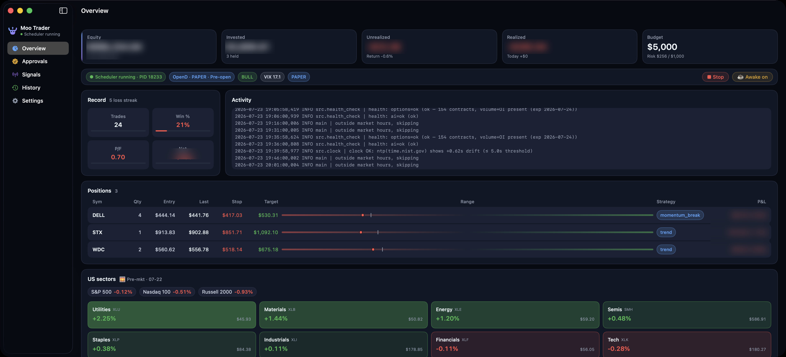
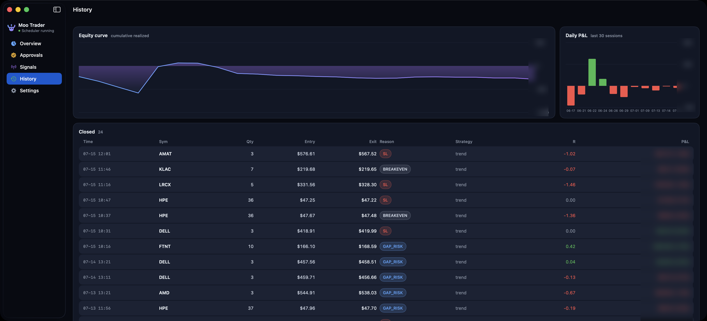
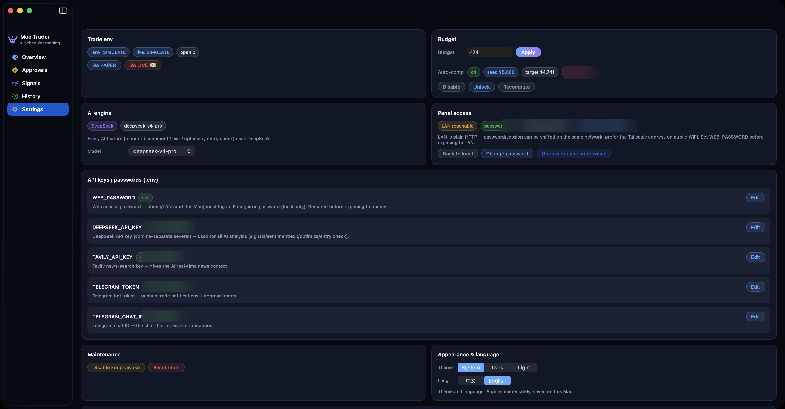
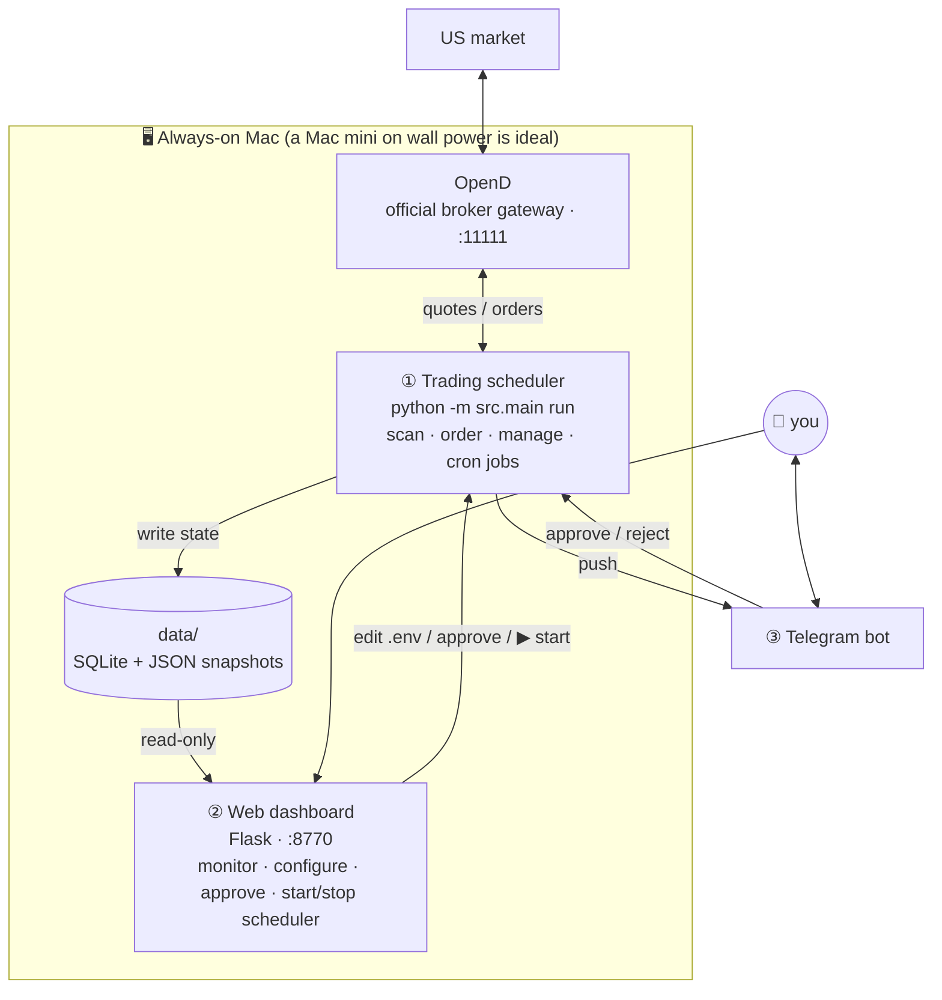
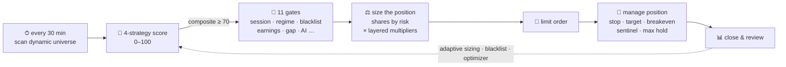

<div align="center">

# 📈 Moo Trader

**An AI-driven, fully autonomous US-stock swing-trading system**

<em>自治、带硬风控的美股短线交易机器人 — 多策略打分、AI 上下文复核、诚实回测、Web 面板与 Telegram 审批。</em>

<br/>

[](https://github.com/ethan6945/moomoo-trader/releases/latest)


[](https://buymeacoffee.com/ethan6945)

<br/>

English · [简体中文](README.zh-CN.md)

<br/>

[✨ Features](#-features) · [🚀 Quick start](#-quick-start) · [🔬 Pipeline](#-trading-pipeline) · [🤖 AI autonomy](#-ai-autonomy) · [❓ FAQ](#-faq) · [☕ Support](#-support)

</div>

<p align="center">
  
  <br/>
  <em>Native macOS app (<code>macos/</code>) · Overview (account figures are masked)</em>
</p>

> [!WARNING]
> **Trading carries a real risk of losing your capital.** This program makes no guarantee of profit. You **must** paper-trade for **at least 4 weeks** before switching to real money. The author is not liable for any losses. See the [Disclaimer](#disclaimer).

---

## What is this

An **autonomous US-stock swing-trading bot**. During US market hours it scans a stock universe (rebuilt automatically every week) every 30 minutes, scores each name with 4 technical strategies, runs it through 11 risk/context gates, places limit orders, and manages stops/targets — all monitored and approved through a **web dashboard + Telegram**.

**Design goal: ~95% automation.** Day to day you just watch the Telegram feed and occasionally approve a parameter suggestion from the optimizer in the web panel.

### 🧭 Two rules that run through the whole system

> **① Live ↔ backtest parity**
> The orders filled in live trading must be the *same set* the honest backtest (the one that computed the $/day numbers) would have taken. Any feature that could make live diverge from the backtest (e.g. AI veto) defaults to "advisory / does not block orders."
>
> **② Nothing ships unvalidated**
> A new strategy or exit rule is only enabled if a two-window backtest shows it **both raises returns and doesn't worsen drawdown**. If it can't clear that bar it stays off — the code stays, waiting for data.

Understand these two and you'll understand why so many features below are "off by default."

---

## ✨ Features

<table>
<tr>
<td width="50%" valign="top">

#### 🎯 Multi-strategy signal engine
Trend, momentum-breakout, mean-reversion, and pattern-recognition — 4 independent strategies scoring 0–100 through one unified `Signal` interface; only a composite score ≥ 70 becomes a candidate.

</td>
<td width="50%" valign="top">

#### 🧱 11 candidate gates
Session, market regime, blacklist, circuit breakers, multi-timeframe confirmation, gaps, earnings, bid-ask spread, AI review, hard risk limits, per-scan cap — fail any one and the name is dropped.

</td>
</tr>
<tr>
<td valign="top">

#### 🤖 AI context review
DeepSeek + Tavily real-time news, to catch what the indicators can't see (lawsuits, blow-ups, regulation…). Advisory by default — it records but never blocks orders, keeping backtest parity intact.

</td>
<td valign="top">

#### 🛡️ Layered hard risk control
5% per-trade risk, 40% single-name cap, intraday drawdown halt, account-drawdown de-risk/halt, loss-streak cooldown, VIX sizing. **AI has no power to bypass any of it.**

</td>
</tr>
<tr>
<td valign="top">

#### 📉 Gap sentinel
A held name near earnings, or a pre-market AI read of hard bad news → auto-liquidate at the open. Stop orders can't stop an overnight gap; the sentinel can.

</td>
<td valign="top">

#### 🧠 Adaptive sizing & blacklist
Scales the risk multiplier (0.5×–1.25×) by the Sortino of the last ~30 trades; repeat-loser names go onto a probation blacklist and are released automatically on recovery.

</td>
</tr>
<tr>
<td valign="top">

#### 🔄 Weekly dynamic universe
Rebuilds the watchlist from a liquidity pool by 6-1 momentum, with out-of-sample replay to avoid survivorship bias, and a Telegram note on every change — never silent drift.

</td>
<td valign="top">

#### 🧪 Honest backtest + two-window gate
Account-level time-stepped simulation (same behavior as live), Monte Carlo ×1000, full Sharpe/Sortino/Calmar suite; plus an independent sandbox engine that reconciles against the backtest at the trade level weekly.

</td>
</tr>
<tr>
<td valign="top">

#### ⚙️ Fully automated tuning
Optuna Bayesian search + an AI optimizer + a daily incremental sweep. In-guardrail suggestions auto-apply and auto-roll-back on regression; out-of-bounds ones require human approval.

</td>
<td valign="top">

#### 🖥 Native macOS app + web dashboard
Native SwiftUI app (`macos/`): Overview / Positions / Approvals / History / Signals / Settings + a menu-bar status icon + approval notifications, EN/中文 toggle, light/dark themes. The full panel (backtests etc.) opens in the browser in one click; the same backend is reachable from your phone (password required).

</td>
</tr>
<tr>
<td valign="top">

#### 📱 Telegram alerts & approvals
Live pushes for orders / stops / status, with "Approve / Reject" buttons that clear the approval queue directly. Important changes don't take effect without your nod.

</td>
<td valign="top">

#### 💰 Idle cash to work (optional)
When bear-market rules stop new entries, park idle cash in a T-bill ETF (SGOV) for a risk-free yield; realized profit can auto-compound into the budget. Both off by default.

</td>
</tr>
</table>

---

## 🖥 Native macOS app

`macos/` is a **native SwiftUI app** (built with SwiftPM — only Command Line Tools needed, no Xcode). Everyday actions are native UI; the full panel (backtests etc.) opens in your default browser in one click. **One-tap EN/中文 switch, light/dark theme (can follow the system), a persistent menu-bar status icon + approval notifications**; the same backend is reachable from your phone (password required).

Prebuilt and signed ad-hoc on the [latest release](https://github.com/ethan6945/moomoo-trader/releases/latest) (Apple Silicon) — that build bundles the Python backend, so it needs no repo and no venv. To build it yourself:

```bash
macos/build.sh                    # freezes the backend, then builds the app
open macos/dist/MooTrader.app     # first launch: System Settings → Privacy & Security → Open Anyway
```

> 📸 In the screenshots below, account balances, P&L, IPs, and API-key suffixes are all masked. The account is a **paper** account.

**Overview** — see the banner image above. Account cards (equity / position value / unrealized / realized / budget), engine & market-state pills, one-click start/stop of the scheduler and sleep-prevention, trade record, a live log that follows the latest line, a positions table (with a stop→target range bar and strategy tags), and a **US-sector heatmap** that scales with the position count.

**History** — equity curve + daily P&L (Swift Charts) + a closed-trades table.

<p align="center"></p>

**Settings** — trade environment (paper↔real switch, with double confirmation and a flat-position gate), budget & auto-compounding, AI engine & model, in-place `.env` key editing, panel access scope (LAN / password / open the full panel in the browser), appearance & language, maintenance, support.

<p align="center"></p>

**Approvals** — one-click ✓ / ✗ on pending items, an archive of handled ones; a system notification fires when a new approval arrives.
**Signals (watch)** — watchlist monitor tiles (price / RSI / volume ratio / VWAP / technical score), an alert stream, watch start/stop, and six one-shot runs.
**Menu bar** — a persistent bull-head icon: scheduler status + PID, OpenD status light, sleep-prevention toggle, start/stop scheduler, and a two-tier "Quit app (trading continues)" / "Quit everything."

---

## Architecture

Three **mutually independent** processes, decoupled through a shared `data/` (SQLite + JSON snapshots) and `.env`:



| Process | Role | Notes |
|------|------|------|
| **OpenD** | Quotes + order gateway | The broker's official local gateway; must run the whole time. `start-web.command` launches it automatically |
| **① Scheduler** | The actual trading brain | APScheduler drives all scanning, position management, and cron jobs; started with ▶ Start from the web panel |
| **② Web dashboard** | Monitor + console | **Doesn't trade itself** — it reads snapshots, edits config, handles approvals; stopping it doesn't affect trading |
| **③ Telegram** | Notify + approve | Pushes orders/stops/status; buttons work the approval queue |

> The scheduler and the web app don't talk directly. Changing mode/budget/approvals in the web UI writes a db-state override or `.env`; the scheduler picks it up on the next scan (hot params need **no restart**).

---

## 🚀 Quick start

**Two ways in.** *Option A* downloads a ready-to-run app — no clone, no Python, no `pip`. *Option B* installs from source: the reference path, the only one that works on Intel Macs, and what the rest of this README assumes.

Either way you need **OpenD** and the API keys under [Requirements](#requirements) below. OpenD is a separate program from the broker app — you install it and log in yourself, and the bot talks to it on `127.0.0.1:11111`. There is no way around that step.

### 📦 Option A — Download the app

1. Grab **`MooTrader-*-arm64.dmg`** from the [latest release](https://github.com/ethan6945/moomoo-trader/releases/latest)
2. Open it, drag **MooTrader** into **Applications**
3. First launch: macOS will say it can't verify the developer. Open **System Settings → Privacy & Security**, scroll down, click **Open Anyway**, then confirm

The app walks you through the rest itself — install and sign in to OpenD, add your AI key, optionally Telegram and Tavily. The dashboard stays locked until the required steps pass, so you can't leave it running half-configured.

**macOS 14+ on Apple Silicon only.** The build is ad-hoc signed and not notarized — this project has no paid Apple Developer ID, which is the entire reason for the "Open Anyway" step. If you'd rather not take that on faith, Option B builds the same app from the source in this repo.

Your `.env`, database, trade history and logs live in `~/Library/Application Support/MooMooTrader/`, outside the app bundle — so upgrading by replacing the `.app` never touches them.

### Requirements

| Dependency | Purpose | Get it |
|------|------|------|
| macOS + Python 3.11+ | Runtime | The install script handles Python for you — **Option A needs neither**, the app bundles its own |
| OpenD | Quotes + order gateway | Download, install, and log in from [openapi.moomoo.com](https://openapi.moomoo.com) |
| Broker app | Open an account + set a trade password | Get the official broker app from [openapi.moomoo.com](https://openapi.moomoo.com) (review takes 1–3 business days; enable Paper Trading) |

**External APIs (all have a free tier):**

| Service | Purpose | Sign up | Free tier |
|------|------|------|---------|
| Broker OpenAPI | Quotes + trading | [openapi.moomoo.com](https://openapi.moomoo.com) | Free |
| DeepSeek | AI review / optimizer | [platform.deepseek.com](https://platform.deepseek.com) | Pay-as-you-go (very cheap) |
| Tavily | News search (fed to the AI) | [app.tavily.com](https://app.tavily.com) | 1000 req/mo |
| Telegram bot | Notify + approve | [@BotFather](https://t.me/BotFather) | Free |

### 🛠 Option B — Install from source

#### 1️⃣ Clone + one-command install

```bash
git clone https://github.com/ethan6945/moomoo-trader.git moo-trader
cd moo-trader
./setup-macmini.command
```

The script does it all: install [uv](https://astral.sh/uv) → rebuild `.venv` on Python 3.11 and install dependencies → install the crontab optimizer jobs for the current path → self-check OpenD and `.env`. Safe to re-run (idempotent).

<details>
<summary>Manual install, without the script</summary>

```bash
python3 -m venv .venv
source .venv/bin/activate
pip install -r requirements.txt
```

</details>

#### 2️⃣ Configure `.env`

```bash
cp .env.example .env
```

At minimum fill these (every key is documented in the template):

| Key | Notes |
|----|------|
| `MOO_TRADE_PWD` | 6-digit **trade password** (separate from your login password; App → Settings → Trade password) |
| `DEEPSEEK_API_KEY` | Comma-separate several for auto-rotation |
| `TAVILY_API_KEY` | News search |
| `TELEGRAM_TOKEN` / `TELEGRAM_CHAT_ID` | Create with @BotFather |
| `ACCOUNT_USD` | Your budget cap — the program will **never** deploy more than this |

#### 3️⃣ Launch

```bash
./start-web.command
```

It automatically: brings up OpenD (if not running) → starts the web dashboard → opens `http://127.0.0.1:8770` in your browser.

For the native macOS experience (window + menu-bar status icon + approval notifications), build the Swift shell once:

```bash
macos/build.sh          # only Command Line Tools, no Xcode
open macos/dist/MooTrader.app
```

MooTrader.app launches (or attaches to an already-running) web server; closing it keeps trading going.

Then click **▶ Start** in the panel to start the trading scheduler (a separate process — close the browser and it keeps trading).

```bash
# equivalent CLI
python -m src.main run    # run the scheduler directly
python -m src.main scan   # single scan for debugging (no loop)
```

Once started, the scheduler will: back-fill cron jobs missed while the machine was off → scan every 30 minutes after the US open → push orders/stops/status to Telegram.

---

## 🔬 Trading pipeline



### Step 1: Strategy scoring

For each name on the watchlist, 4 independent strategies each score 0–100; the highest score represents that name. All 4 share one `Signal` interface, so the downstream funnel doesn't care which strategy produced a signal (it only records a `strategy` tag).

> **Live currently runs only the first two (trend + momentum-breakout); mean-reversion and pattern-recognition are off by default** — see [Config at a glance](#-config-at-a-glance) for why. Entry bar: composite score ≥ `ENTRY_SCORE_THRESHOLD` (**70**, tuned by Optuna, a hard threshold with no edge band).

| Strategy | Module | Style | Status |
|------|------|------|:----:|
| ① Trend | `indicators.py` | EMA/MACD/volume/ADX/VWAP six-factor confluence | ✅ |
| ② Momentum breakout | `strategy_momentum.py` | Hunts volume breakouts of 20-bar highs (few trades, big each) | ✅ |
| ③ Mean reversion | `strategy_mr.py` | Oversold bounce in ranges | ❌ off by default |
| ④ Pattern recognition | `strategy_pattern.py` | Double bottom / triangle / H&S / bull flag geometry | ❌ off by default |

<details>
<summary><b>📐 Expand: per-strategy factors and weights</b></summary>

> Each strategy's weights sum to 90 (AI review historically held the last 10 points; it's now an independent advisory layer, not folded into the score).
>
> **Glossary**: **EMA** exponential moving average (recent prices weighted higher) | **MACD** fast-minus-slow MA, for momentum turns | **RSI** relative strength 0–100, >70 overbought <30 oversold | **Stochastic** where the close sits in the recent high-low range | **ADX** trend strength (not direction) | **VWAP** volume-weighted average price (institutional cost line) | **BB** Bollinger Bands, MA ±2σ channel | **ATR** average true range, used to size stops/targets.

**Strategy ① Trend** (live HOUR_1 weights):

| Factor | Meaning | Full-score condition | Weight |
|------|------|---------|:--:|
| trend | EMA9 > EMA21 with upward slope | cross+up 100 / flat 60 / death cross 0 | **18** |
| momentum | MACD cross + RSI 40–70 + Stochastic 20–80 | all three 100 / partial 70/40 | **18** |
| volume | current bar vol ÷ 20-bar avg | ≥1.5× → 100 / ≥1.0× → 50 | **14** |
| pattern | break of 20-bar high / BB lower-band bounce | breakout 100 / lower-band bounce 90 / green close 40 | **14** |
| adx | ADX value | ≥25 → 100 / ≥20 → 70 / ≥15 → 30 | **13** |
| vwap | close vs 20-period rolling VWAP | above +0.5% → 100 / flat 60 | **13** |

**Strategy ② Momentum breakout** (pickier, for explosive breakouts):

| Factor | Full-score condition | Weight |
|------|---------|:--:|
| breakout | close clears the 20-bar high by ≥ 0.3×ATR | **30** |
| volume | ≥ 2× average | **25** |
| adx_trend | ADX ≥ 30 (real trend, not chop) | **20** |
| structure | EMA9 > EMA21 > EMA50 fully bullish stack | **15** |

**Strategy ③ Mean reversion** (off by default): oversold (RSI<25 + below BB lower band) 25 / reversal (hammer, reclaim lower band) 25 / volume 20 / non_trend (only valid when ADX<25) 20.

**Strategy ④ Pattern recognition** (off by default): pattern_quality 30 / trigger (broke a key level?) 25 / volume 20 / trend_alignment 15. Optional `pattern_vision` (chart confirmation, needs a vision-capable multimodal model; inert under plain DeepSeek) is also off by default.

</details>

### Step 2: The candidate funnel

Signals scoring ≥ 70 go through the gates high-to-low — **fail any gate and the name is skipped**:

| # | Gate | Rule | Module |
|---|----|------|------|
| 1 | Session | 09:45–15:30 ET; no new entries after 14:00 Fri (weekend-gap guard) | `kill_switch` |
| 2 | Market regime | SPY below both its 50 & 200-day MA = BEAR → no new entries | `regime` |
| 3 | Adaptive blacklist | Recent repeat-loser in its probation window → skip | `blacklist` |
| 4 | Circuit breaker | intraday drawdown / account drawdown halt / 3-loss streak → no entries | `kill_switch` |
| 5 | Multi-timeframe | daily EMA20 > EMA50 (required in HOUR_1 mode) | `indicators` |
| 6 | Overnight gap | \|gap\| > 4% → reject (don't chase, don't catch knives) | `indicators` |
| 7 | Earnings screen | ≤ 2 days to next earnings → reject | `earnings` |
| 8 | Bid-ask spread | spread > 0.5% → reject (poor liquidity) | `moo_client` |
| 9 | AI review | DeepSeek + Tavily check for "landmines the indicators miss"; **advisory, doesn't block**, and asks after ordering to save latency | `ai_validator` |
| 10 | Risk gate | 24h stop cooldown / max positions / cash / budget cap | `risk_manager` |
| 11 | Per-scan new-name cap | at most 2 new names per scan; adding to old positions doesn't count | `main` |

### Step 3: Position sizing

`risk_manager.calc_position_size` — a layered "shares by risk," each factor multiplied independently:

```text
base risk $ = available capital × RISK_PER_TRADE(5%)
   × loss-streak cooldown   (2 losses 0.75× / 3 losses 0.5×)
   × account-DD de-risk     (account drawdown ≥ 10% → 0.5×)
   × adaptive sizing        (Sortino of last 30 → 0.5× ~ 1.25×)
   × conviction             (full-score signal 1.0)
   × with-trend boost       (only "strong bull + low VIX" → 1.4×)

shares by risk  = risk $ ÷ (entry − stop)
shares by cap   = capital × MAX_POSITION_PCT(40%) ÷ entry   ← single-name concentration cap
final shares    = min(the two), then adjusted by VIX (>25 halve, >35 quarter)
```

- **Capital basis**: uses your allotted budget `ACCOUNT_USD`, but never exceeds live account equity. Budget is editable in the web panel and takes effect on the next scan.
- **The 40% single-name cap is the real gap guard** — stops can't stop a gap (price jumps straight past the stop), so you protect yourself by "not betting too big," not by "watching more closely."

### Step 4: Exit management

Stops/targets all scale by ATR (managed in `executor.py`):

| Exit | Trigger | Status |
|---------|------|:--:|
| Soft stop (SL) | price ≤ entry − 3.5×ATR | ✅ always on |
| Take profit (TP) | price ≥ entry + 10×ATR | ✅ always on |
| Breakeven trailing stop | at +1R the stop moves to entry (a winner never becomes a loser) | ✅ |
| Fast-stop loop | every 60s a single check of soft stop + breakeven (covers paper's lack of native STOP orders) | ✅ |
| Max hold | force-close after 7 trading days | ✅ always on |
| Gap sentinel | held name with earnings ≤1 day / pre-market AI hard bad news → liquidate at the open | ✅ |
| Blacklist / over-limit close | force-close a held name that hits the blacklist; trim the worst when over the position limit | ✅ always on |
| Scale-out | sell 1/3 at +3R and +6R | ⚠️ intentionally idle (backtests show it kills fat-tail profit) |
| Smart / stall exit | intraday AI locks profit on bad news / free capital after days of no move | ❌ off by default (hasn't cleared the validation gate) |

> **Manual position adoption**: a name you bought yourself in the broker app is "adopted" on reconciliation and tagged `user_managed` (immune to all automatic exits). After the system assesses it: normal → hand stop management to the bot; high-risk → send a Telegram approval to let you decide.

---

## 🛡️ Hard risk constraints

Neither the AI nor the optimizer **can** bypass these:

| Rule | Threshold | Action |
|------|------|------|
| Per-trade risk | 5% | shares by risk |
| Single-name position | 40% | shares cap |
| Concurrent positions | 5 (scales with budget) | reject new entries |
| Intraday drawdown | −6% | halt for the day |
| Account drawdown ≥ 10% | half size | all new positions 0.5× |
| Account drawdown ≥ 18% | halt | auto-lifts after 7 days |
| 3-loss streak | 3 net-loss days in a row | pause entries |
| Stop cooldown | same name for 24h | no re-buy |
| Earnings screen | ≤ 2 days | reject new entries |
| Regime BEAR | SPY broken down | no new entries |
| VIX sizing | >25 / >35 | halve / quarter |

---

## 🤖 AI autonomy

> Goal: 95% automation — you just watch Telegram.

1. **Adaptive sizing** (`adaptive_sizing.py`) — reads the last 30 closed trades and scales the risk multiplier by trading-day Sortino: hot hand 1.25×, normal 1.0×, cold 0.75×, losing streak 0.5×.
2. **Adaptive blacklist** (`blacklist.py`) — repeat-loser names enter a probation window (threshold floats with overall Sortino); removed immediately on recovery, extended (up to 90 days) if they keep underperforming.
3. **Weekly dynamic universe** (`universe.py`) — picks the top-15 by 6-1 momentum from a liquidity pool to rebuild the watchlist, with out-of-sample replay to avoid survivorship bias, and a Telegram note on every change.
4. **AI optimizer + Autopilot** (`optimizer_ai.py` / `autopilot.py`) — weekly review of real fills → the AI proposes small parameter tweaks → each is two-window backtested on the honest engine (180d + 360d) → only those that **beat the baseline without worsening drawdown** enter the queue. In-guardrail ones auto-apply + auto-roll-back on regression; out-of-bounds ones need human approval.
5. **Daily incremental sweep + weekly full grid** (`cron/optimize_and_apply.sh`, crontab-driven) — each day back-fills yesterday's data for a neighborhood check; each week runs a full-grid sweep on the market's day off.
6. **Monthly Optuna tuning** (`optimizer.py`) — TPE Bayesian + out-of-sample K-fold, Telegram suggestions only, **never edits `.env` automatically**.
7. **Sandbox differential reconciliation** (`sandbox.py` + `scripts/sandbox_vs_backtest.py`) — an independent simulation engine reconciles against the backtest engine at the **trade level** weekly, alarming only when divergence exceeds tolerance — so the two engines can't silently drift.
8. **Health sentinel** (`health_check.py` / `autopilot.health_check`) — API quota, subscriptions, scan stalls, reconciliation drift… notifies only on trouble (edge-triggered, no spam).
9. **Missed-job back-fill** (`cron_state.py`) — cron jobs missed while the machine was off are back-filled on boot; multiple misses back-fill only once.

### The approval gate (the only entry point for changes)

Any **non-silent change** (parameter change, manual position adoption, an out-of-bounds optimizer suggestion) must pass the approval queue (`approvals.py`) before it takes effect. Approvals are handled in the web panel or via Telegram buttons; once approved they take effect on the next scan.

> Clear boundary: **the bot decides on its own orders** (never asks you); only your manual orders, or an out-of-bounds parameter change, trigger an approval.

---

## 🧪 Backtesting & tuning

```bash
# honest account-level backtest (time-stepped portfolio simulation, same behavior as live)
python -m src.backtest --days 180
python -m src.backtest_v3          # v3 engine (with scale-out / breakeven / OOS dynamic universe)

# Optuna tuning (out-of-sample K-fold)
python -m src.optimizer --days 180 --trials 20 --folds 3 --min-trades 60
```

Output includes: Win rate / Profit factor / Expectancy, Sharpe / Sortino / Calmar / MAR / Ulcer, Max DD / underwater days, **Monte Carlo ×1000 P(profitable)**, monthly PnL.

> [!NOTE]
> **Honest expectations**: it won't win every month. ~15–25% annualized with ~10% max drawdown is the realistic range. The $/day figures in the backtest are relative conclusions for a specific window, not a promise; a regime change can make any strategy lose money.

---

## ⏰ Scheduled jobs

<details>
<summary><b>Expand the full job table</b></summary>

**Scheduler built-ins** (APScheduler, missed-while-off jobs auto-back-fill):

| Time | Job | Module |
|------|------|------|
| every 30 min (market hours) | scan signals + manage + order | `run_loop` |
| every 5 min (intraday, holding) | manage tick (stop/target/max-hold) | `_manage_tick` |
| every 60s (intraday, holding) | fast-stop loop (soft stop + breakeven only) | `_fast_stop_tick` |
| weekdays 08:30 ET | pre-open NTP sync + holiday check | `_preopen_clock_check_job` |
| weekdays 09:00 ET | pre-market gap-sentinel analysis | `_premarket_gap_sentinel_job` |
| weekdays 09:31 ET | liquidate flagged gap-risk names at the open | `_open_gap_exit_job` |
| weekdays 16:45 ET | compounding budget settlement (when enabled) | `_daily_auto_budget_job` |
| weekdays 17:30 ET | Autopilot health watchdog | `_watchdog_job` |
| weekdays 23:00 ET | blacklist review | `_daily_blacklist_review_job` |
| Mon 20:00 KL | Autopilot weekly review (suggest→backtest→auto-apply in-guardrail) | `_weekly_autopilot_job` |
| Mon 20:05 KL | dynamic-universe refresh | `_universe_refresh_job` |
| Mon 20:10 KL | 90-day backtest health check | `_weekly_backtest_validation_job` |
| Mon 20:15 KL | real-fill self-review | `_weekly_self_review_job` |
| Mon 20:25 KL | sandbox ↔ backtest trade-level diff | `_weekly_sandbox_diff_job` |
| 1st of month 03:00 ET | Optuna tuning (suggestions only) | `_monthly_optuna_job` |
| 1st of month 03:30 ET | TP/SL leverage-drift recheck (suggestions only) | `_monthly_lever_recheck_job` |
| every 5 min | Telegram approval sync | `_tg_sync` |
| every 30 min + on start | API / subscription health check | `_api_health_job` |
| on start | missed-job back-fill | `cron_state` |

**System crontab** (installed by `setup-macmini.command`, independent of the scheduler):

| Time (MYT) | Job |
|------------|------|
| Mon 07:00 (US market closed) | weekly full-grid quick-sweep optimization |
| Tue–Sat 09:00 | daily incremental optimization (back-fill yesterday + neighborhood check) |

> The Monday batch is pinned to Asia/Kuala_Lumpur (no DST), so US DST changes don't shift the wall-clock time.

</details>

---

## 🔧 Config at a glance

All config lives in `.env` (the template [`.env.example`](.env.example) documents every key); common ones are hot-editable in the web panel.

<details>
<summary><b>Key features on by default</b></summary>

| Setting | Value | Notes |
|------|----|------|
| `MOO_TRADE_ENV` | `SIMULATE` | Paper. Switching to REAL must be done in the web Settings (double confirm + trade password + flat positions only) |
| `GAP_SENTINEL_ENABLED` | `true` | Gap sentinel: earnings near or hard bad news → liquidate at the open |
| `USE_BREAKEVEN_STOP` | `true` | +1R breakeven trailing stop |
| `REAL_USE_SOFT_EXITS` | `true` | REAL also uses soft exits, matching backtest parity |
| `DYNAMIC_UNIVERSE_ENABLED` | `true` | Rebuild the watchlist weekly by 6-1 momentum |
| `UNIVERSE_TOP_N` | `15` | Pick 15 (10/15/20 plateau tested: 15 is best) |
| `AUTO_APPLY_PARAMS` | `true` | Suggestions that pass the two-window backtest and are in-guardrail auto-apply + auto-roll-back on regression |
| `REGIME_BULL_MULT` | `1.4` | With-trend boost (only strong bull + low VIX) |
| `HEALTH_CHECK_ENABLED` | `true` | Probe API/subscription every 30 min, edge-triggered Telegram if it drops |
| `FAST_STOP_SECONDS` | `60` | Fast-stop loop interval |

</details>

<details>
<summary><b>Features off by default (and why)</b></summary>

| Setting | Why it's off |
|------|---------|
| `AI_VETO_BLOCKING` | **Not fear of the AI — it's parity**: the honest backtest has no AI-veto layer, so if live let the AI block orders, fills wouldn't be the same set as the backtest. The AI still runs, records, and shows on the buy card, but doesn't block |
| `MR_ENABLED` | Mean reversion nets a loss in the current bull-leaning universe (combo sweep ≈ −$4/day). Kept for when the market turns choppy |
| `PATTERN_ENABLED` | The pattern strategy doesn't raise returns in backtests and doubles max DD — fails the "don't worsen drawdown" gate. No edge, no ship |
| `PATTERN_VISION_ENABLED` | Depends on the pattern strategy; and HOUR_1 history can't produce a second independent backtest window |
| `SMART_EXIT_ENABLED` | Intraday AI/technical smart exit, unvalidated; overnight risk is already covered by the sentinel |
| `SENTIMENT_SCORING_ENABLED` | Broker-app-style bull/bear scoring, purely advisory and doesn't change orders; off by default to save API calls |
| `NEWS_DRIVEN_ENABLED` | **The only switch that invalidates the backtest.** Inverts the funnel: the rule score demotes to a tradeability prefilter and the AI news read selects + sizes, with an EOD flatten so nothing carries overnight. The sandbox deliberately skips AI (LLM look-ahead), so while this is on the backtest measures a *different* strategy. No factor study backs it either — live results are the experiment. Fail-safe inverts too: no news ⇒ no trade |
| `OPTIONS_FLOW_ENABLED` | Options flow is only consumed by smart_exit / sentiment (both off), so enabling it alone is pointless |
| `STALL_OUT_ENABLED` | Stall exit. The validation engine doesn't have it, and the max-hold bucket nets a profit; the only stall exits in live all lost |
| `SMART_REGIME_ENABLED` | Hysteresis-smoothed regime label (500-day backtest: flips −89%). Off to stay byte-for-byte identical to the backtest |
| `AUTO_BUDGET_ENABLED` | Compounding budget: realized profit auto-rolls into the budget (guardrails: seed×0.5–5, equity cap, hysteresis step) |
| `CASH_YIELD_*` | Park bear-market idle cash in a T-bill ETF (SGOV) for yield, sold back to cash when the market turns bullish |
| `INVERSE_SLEEVE_ENABLED` | Inverse-ETF hedge (a cash account can't short). **The only feature that can lose money in a new way** — must clear its own two-window backtest gate first |
| `USE_SCALE_OUT` | Scale-out is **intentionally idle**: backtests show a lower ladder that actually triggers reduces $/day (banking too early kills fat tails) |

**Removed** (no longer switches): the ML/XGBoost subsystem (AUC≈0.5 proved it useless); the DAILY trading timeframe (HOUR_1 backtests won decisively; DAILY data is still used for multi-timeframe confirmation / regime).

> **AI engine**: the whole system uses **DeepSeek** (`DEEPSEEK_API_KEY`); entry review runs through a single engine. Gemini was removed from the optional engines; chart-pattern confirmation (which needs a vision model) was retired with it.

</details>

<details>
<summary><b>Key numbers (Optuna / backtest-tuned)</b></summary>

| Param | Value | Param | Value |
|------|----|------|----|
| `ENTRY_SCORE_THRESHOLD` | 70 | `TP_ATR_MULT` | 10.0 |
| `SCAN_INTERVAL_MIN` | 30 | `SL_ATR_MULT` | 3.5 |
| `TIMEFRAME` | HOUR_1 | `MAX_GAP_PCT` | 4.0 |
| `MAX_HOLD_DAYS` | 7 | `RISK_PER_TRADE` | 0.05 |
| `MAX_POSITIONS` | 5 | `MAX_POSITION_PCT` | 0.40 |
| `DAILY_DRAWDOWN_STOP` | 0.06 | `DD_HALT_PCT` | 18 |

</details>

---

## 📁 Project structure

<details>
<summary><b>Expand the directory tree</b></summary>

```text
moo-trader/
├── src/                              # trading core
│   ├── main.py                       # entry: scan + schedule + missed-job back-fill
│   ├── config.py                     # .env → settings (feature flags + defaults)
│   ├── moo_client.py                 # OpenD wrapper (quotes / orders / snapshots)
│   │
│   ├── indicators.py                 # strategy ① trend (6 factors) + MTF/gap helpers
│   ├── strategy_momentum.py          # strategy ② momentum breakout
│   ├── strategy_mr.py                # strategy ③ mean reversion (off by default)
│   ├── strategy_pattern.py           # strategy ④ pattern recognition (off by default)
│   ├── pattern_detect.py             # pure-numpy geometry / candlestick detection
│   │
│   ├── ai_validator.py               # DeepSeek+Tavily: buy review / gap / sentiment
│   ├── regime.py                     # SPY 50/200MA market regime (VIX-aware)
│   ├── earnings.py / gap_sentinel.py # earnings screen / gap sentinel
│   │
│   ├── risk_manager.py               # sizing + hard risk control + DD breaker
│   ├── adaptive_sizing.py            # adaptive risk multiplier
│   ├── blacklist.py / kill_switch.py # blacklist / unified circuit breaker
│   ├── executor.py                   # order + soft exits + breakeven + max hold
│   ├── reconcile.py                  # broker vs local reconciliation (orphan adoption)
│   │
│   ├── universe.py                   # weekly dynamic universe
│   ├── backtest.py / backtest_v3.py  # honest account-level backtest engines
│   ├── sandbox.py                    # independent simulation engine (diff baseline)
│   ├── optimizer.py / optimizer_ai.py# Optuna / AI optimizer
│   ├── autopilot.py / self_review.py # weekly review + health watchdog
│   ├── auto_budget.py                # compounding budget (optional)
│   ├── cash_yield.py                 # bear-market cash yield (optional)
│   ├── inverse_sleeve.py             # inverse-ETF hedge (optional, unvalidated, off)
│   │
│   ├── approvals.py / tg_approvals.py# approval queue + Telegram sync
│   ├── notifier.py / audit.py        # push / decision audit
│   ├── db.py / runtime_config.py     # SQLite / hot-param overrides
│   ├── cron_state.py / clock.py      # missed-job back-fill / NY time + NYSE calendar
│   └── ...
│
├── web/
│   ├── server.py                     # Flask backend (monitor / config / approve / start-stop scheduler)
│   └── static/index.html             # single-page front end (bilingual)
├── config/
│   ├── watchlist.json                # auto-generated trading pool (don't hand-edit)
│   └── universe_pool.json            # liquidity candidate pool (universe input)
├── cron/optimize_and_apply.sh        # daily incremental / weekly full-grid optimization (crontab)
├── scripts/                          # backtest / calibration / validation tools
├── macos/                            # native SwiftUI shell (window + menu bar, build.sh)
├── data/                             # runtime state (gitignored)
├── logs/                             # logs (gitignored)
│
├── setup-macmini.command             # 🖱 one-command install (uv + venv + deps + crontab)
├── start-web.command                 # 🖱 one-command launch (OpenD + web panel)
└── .env.example                      # config template (every key documented)
```

</details>

---

## ✅ Go-live checklist

> Don't skip steps. Every one is there to protect your money.

- [ ] OpenD working on a Paper Trading account (web status bar all green)
- [ ] `python -m src.main scan` shows signals being scored
- [ ] Telegram receives a test push
- [ ] `python -m src.backtest --days 180`: Sortino > 2 and P(profitable) > 90%
- [ ] **Paper trade for at least 4 weeks**, logging every trade
- [ ] Before real money: paper Sortino > 1.5 and win rate > 55%
- [ ] Switch to REAL in web Settings (double confirm + trade password + flat positions only)
- [ ] First week deploy only **USD $500** to validate the order path
- [ ] After two stable weeks, ramp up to your target capital
- [ ] Review the Optuna / optimizer suggestions monthly

---

## ❓ FAQ

<details>
<summary><b>OpenD asks to "unlock trading" after launch?</b></summary>

The GUI OpenD can't unlock trading via API — click "unlock trading" once in the OpenD window manually. After that the bot logs in automatically using the MD5-hashed `MOO_TRADE_PWD`.

</details>

<details>
<summary><b>Paper Trading doesn't support STOP orders — now what?</b></summary>

Paper has no native STOP order, so the bot uses "main loop detects price ≤ stop → market soft-close," with a 60-second fast-stop loop to cut latency to seconds. REAL also uses the same soft exits by default to align with the backtest (`REAL_USE_SOFT_EXITS=true`); turn it off to use the broker's OCO bracket instead (a broker-side backstop even if the process dies, but it diverges from backtest parity).

</details>

<details>
<summary><b>Are the scheduler and the web the same process?</b></summary>

No — **two independent processes**. The scheduler (`src.main run`) trades; the web (`web/server.py`) only monitors/controls, starting/stopping the scheduler with ▶ Start / ■ Stop. Editing backend code means restarting the relevant process; stopping the web doesn't affect trading.

</details>

<details>
<summary><b>Is the AI expensive?</b></summary>

It uses DeepSeek — plain text, pay-as-you-go, extremely cheap. Buy-review AI runs at most 10 times per scan, ~12 scans/day in market hours, so daily cost is negligible. The AI is FAIL-SAFE by design: a failed call degrades to a neutral "pass," so it never dumps positions just because the AI is unavailable.

</details>

<details>
<summary><b>What's the difference between the DD breaker and the 3-loss-streak breaker?</b></summary>

3-loss streak: 3 net-loss days in a row → pause (counted by day). DD breaker: total account drawdown ≥10% half-size, ≥18% halt (by account-level peak, auto-lifts after 7 days). The two stack independently.

</details>

<details>
<summary><b>Can I hand-edit the watchlist?</b></summary>

Not `config/watchlist.json` directly (it's overwritten weekly). To adjust, edit the liquidity pool `config/universe_pool.json` or `UNIVERSE_TOP_N`.

</details>

<details>
<summary><b>Does Mac sleep interrupt trading?</b></summary>

Yes, so keep-awake is built in (`src/keepawake.py`, toggleable from the web panel/menu bar): `caffeinate` blocks system idle sleep (the screen may sleep), optionally also blocking lid-close sleep. A wall-powered dedicated machine is recommended.

</details>

<details>
<summary><b>Can I view it on my phone?</b></summary>

Yes. Set `WEB_PASSWORD` in web Settings, then change `WEB_HOST` to your LAN address to reach it from a phone browser (with no password the panel refuses to expose itself to the network). Telegram pushes are cross-platform by nature.

</details>

<details>
<summary><b>Why are so many features off by default?</b></summary>

The two rules: ① live must match backtest parity; ② a feature that hasn't cleared a two-window backtest (raise returns and not worsen drawdown) doesn't ship. The off code stays, waiting to be validated and enabled once there's enough data.

</details>

---

## 🧰 Tech stack

| Layer | Tech |
|----|------|
| Language / runtime | Python 3.11 · APScheduler |
| Broker interface | moomoo-api SDK (quotes + trading) |
| AI | DeepSeek (review / optimizer / sentiment) · Tavily (news) |
| Quant | pandas + pandas-ta-classic · Optuna · yfinance |
| Storage | SQLite + JSON snapshots |
| UI | Native SwiftUI app (`macos/`: Overview/Approvals/Signals/History/Settings + menu bar) · Flask single-page dashboard · python-telegram-bot |

---

## Disclaimer

This is a **personal research project** and is **not financial advice**.

- Trading stocks carries a real risk of losing capital; historical backtests don't represent future performance.
- Profit expectations assume the market continues the characteristics of past backtest windows; a regime change can make any strategy lose money.
- Always paper-trade ≥ 4 weeks before using real money; for your first real-money run, deploy only an amount you can fully afford to lose.

**The author is not liable for any financial loss arising from use of this program.**

---

## ☕ Support

This project is **completely free and open source** (MIT License) — no paywall, no license keys.

If it helps you, here are ways to support continued development:

- ⭐ Star the repo
- ☕ [Buy Me a Coffee](https://buymeacoffee.com/ethan6945)
- 💖 [GitHub Sponsors](https://github.com/sponsors/ethan6945)

## License

[MIT](LICENSE) © 2026

<div align="center">
<br/>

If this project inspired you, a ⭐ is always welcome.

</div>
